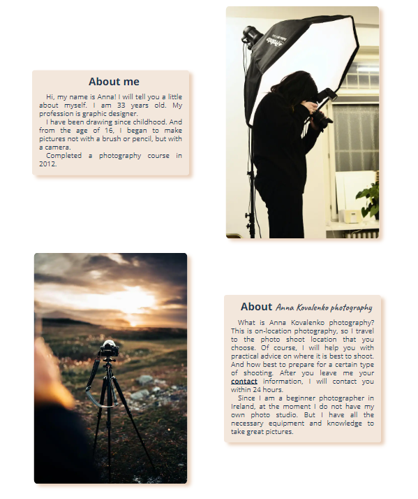
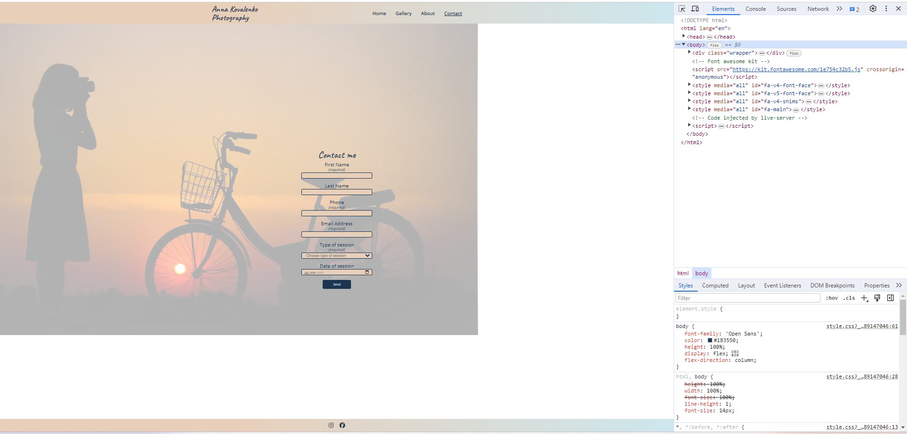
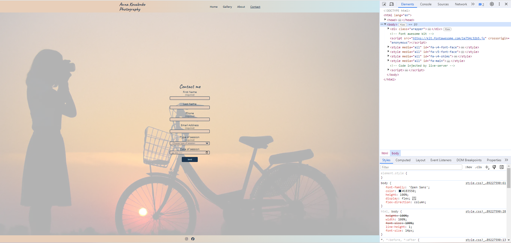
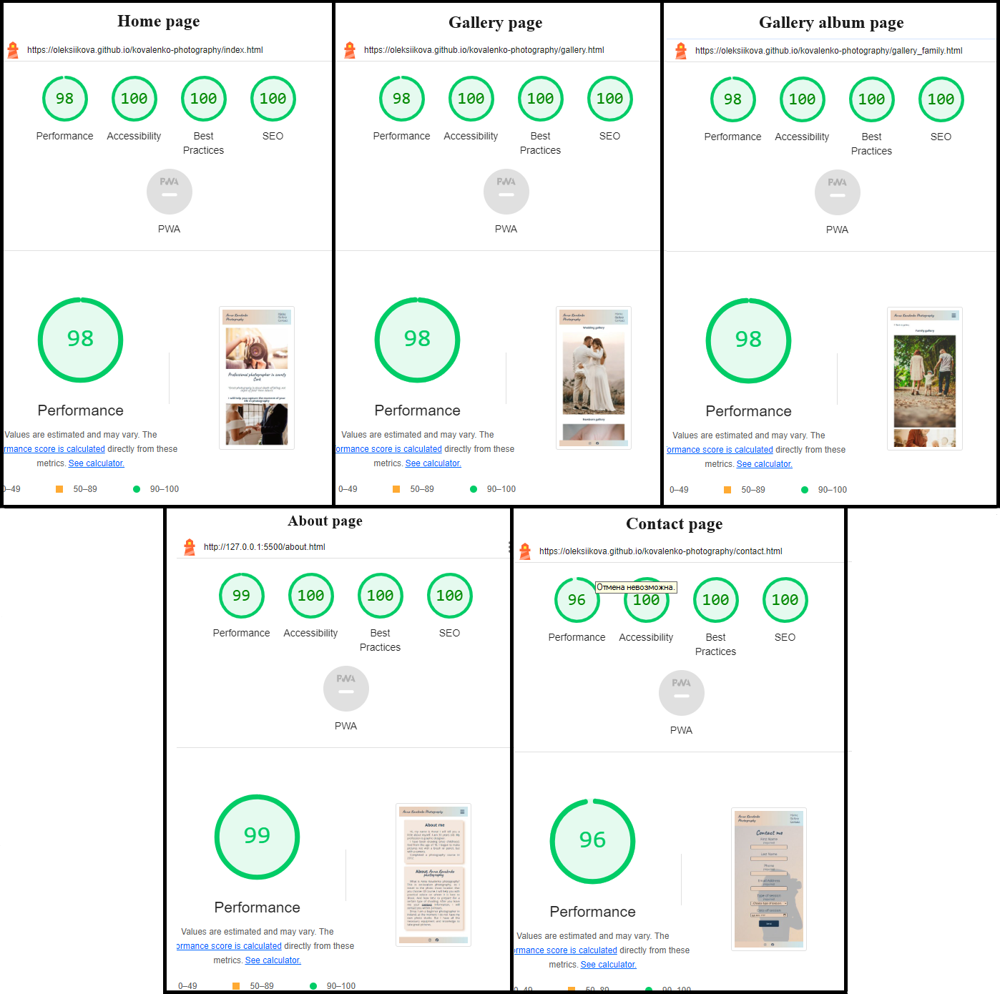

# Kovalenko photography

Kovalenko photography is a website that will help people find a professional photographer for their photo shoot. The site will be targeted toward people who want to capture different moments and events of their lives in photographs.

## Technologies

1. Balsamiq - to create a wireframe.
2. HTML - to create a basic site.
3. CSS - to create front-end and to give a great user experience.
4. GitHub - source code hosting and deployment.

## UX

### Strategy
Since this is my first software project, I chose to create a simple photography services website. This website will allow the photographer to attract potential clients.

### Scope
For users interested in photography services, I wanted to introduce them to a professional photographer. The website contains information about what services are provided and examples of work. And also allows you to stay in touch.

### Structure
Website pages:
1. Home page: contains introduction section and services section.
2. Gallery page: allows to select three different gallery albums. 
3. Gallery wedding/Gallery newborn/Gallery family: contains relevant photos.
4. About page: information about the photographer.
5. Contact page: allows user to stay in touch.

All pages have a header that allows you to navigate to different pages from any place and a footer that contains links to the photographer's social media.  

### Skeleton
The website is designed to be clear and simple. To create a wireframe I used Balsamiq software. PDF file with my wireframe you cand find [here](/readme_images/wireframe_kovalenko_photography.pdf).

### Surface
To prevent the site from being too cluttered, I used a palette of only three colours.

For the contact page I selected an image that consists of similar shades of color that I used for the content.

## Features

### Existing Features
- __Navigation Bar__
    - Featured on all three pages, the full responsive navigation bar includes links to the Logo, Home page, Gallery and Contact page and is identical in each page to allow for easy navigation.
    - This section will allow the user to easily navigate from page to page across all devices without having to revert back to the previous page via the ‘back’ button. 
    
    

- __Introduction section__

  - The introduction section includes photo of the photographer with text where the photographer works, to allow the user to see exactly which location this site would be applicable to. 
  - This section also contains a quote that attracts the consumer's attention.

  

- __Services section__

    - The services section will allow the user to see which type a photo session is available.
    - From this section user will have access to two ways of possible further use of the site: 
        1. click on the photo of the service and get acquainted with the photographer’s work in more detail;
        2. click on the button "Book a sesion" and go to the Contact page.
        
        

- __The Footer__ 

    - The footer section includes links to the photographer's relevant social media sites. The links will open to a new tab to allow easy navigation for the user. 
    - The footer is valuable to the user as it encourages them to keep connected via social media
    
    

- __The Gallery page__ 

    - The gallery will provide the user with images to see more details of the photographer’s work.
    - The gallery page contains three albums with different types of photo shoots (wedding, newborn and family). 
    
    

- __The Gallery album page__

    - The Gallery album page contains examples of the photographer's work. 
    - This page was created to attract the attention of potential clients and further use of the photographer’s services.
    
    

- __The About page__

    - The about page contains information about photographer.
    - This page allows to get to know the photographer better and introduces to the necessary initial information about the photo shoot.

    

- __The Contact page__

    - This page allows the user to leave their contact information. So that the photographer can contact and discuss the details of the shooting.
    - The user will be asked to submit their full name, phone, email address, type of session and data of section. Some of them are required. 
    
    

### Features Left to Implement

- As I progress through the course and learn the back-end, I would like to set correct value of the action attribute of the form tag. So after press the send button, I receive an email with data.

## Testing 

### Manual testing

- The Kovalenko photography website has been tested on different screen sizes (phone, tablets and laptop). 
- The website also has been tested on different browsers (Chrome, Opera, Safari and Microsoft Edge)
- Logo, home, gallery and contact links in the navbar have been tested. When clicked, it will take you to the relevant page. Link's text on active page is underline.
- When you hover over a picture with the type of photo session, the text “Click to open gallery” appears. When clicked opens relevant gallery.
- When you hover the button "Book a session" changes color of button, when you click button a little bit transform (creates the effect of pressing a physical button). 
- Facebook and Instagram links on the footer opens relevant photographer's profile on social media platform. 
- On the gallery page when you click on the name of gallery or the photo of gallery, it opens relevant photo album. 
- When you are in the Wedding gallery, Newborn gallery or Fammily gallery you can click on button "< Back to gallery" and it return you to Gallery page and you can choose another gallery album.
- On the page Contact if you will not fill out required field, the button "Send" will not be work. And a notification about it will appear. 
- After filling in all the required fields you can click the "Send" button and it will works.

### Validator Testing 

- HTML
  - No errors were returned when passing through the official W3C validator: [Home page](https://validator.w3.org/nu/?doc=https%3A%2F%2Foleksiikova.github.io%2Fkovalenko-photography%2Findex.html), [Gallery page](https://validator.w3.org/nu/?doc=https%3A%2F%2Foleksiikova.github.io%2Fkovalenko-photography%2Fgallery.html), [Gallery album page](https://validator.w3.org/nu/?doc=https%3A%2F%2Foleksiikova.github.io%2Fkovalenko-photography%2Fgallery_family.html), [About page](https://validator.w3.org/nu/?doc=https%3A%2F%2Foleksiikova.github.io%2Fkovalenko-photography%2Fabout.html), [Contact page](https://validator.w3.org/nu/?doc=https%3A%2F%2Foleksiikova.github.io%2Fkovalenko-photography%2Fcontact.html).
- CSS
  - No errors were found when passing through the official [(Jigsaw) validator](https://jigsaw.w3.org/css-validator/validator?uri=https%3A%2F%2Foleksiikova.github.io%2Fkovalenko-photography%2Findex.html&profile=css3svg&usermedium=all&warning=1&vextwarning=&lang=en)

### Fixed Bugs

 - When zoomed out on the contact page on larger screens, the background image did not completely fill the screen.

 

  To solve this problem, the width property was applied with a value of 100% for screens larger than 992 px.

  

## Lighthouse Test

Thanks to the Lighthouse test, which is built-in the Google Chrome browser, such important indicators as performance, accessibility and SEO have been improved to almost the maximum value.

## Deployment

The site was deployed to Git Hub pages using the following steps:

  - In the Github repository, the Setting tab.
  - In the left side of the screen in Code and Automation section select 'Pages'.
  - In the Build and Deployment section for Source, select 'Deploy from a branch' from the drop-down list.
  - For Branch, select 'main' from the drop-down list and Save.
  - On the top of the page, the link to the complete website is provided.
  - The deployed site will update automatically upon new commits to the master branch.

The live link can be found [here](https://oleksiikova.github.io/kovalenko-photography/index.html).

## Credits

### Content

- The icons in the footer were taken from [Font Awesome](https://fontawesome.com/).
- To add the overlay (to the picture of type of sessions on Home page) were taken code from [W3schools](https://www.w3schools.com/howto/tryit.asp?filename=tryhow_css_image_overlay_title).
- To create a mobile navigation menu were taken piece of code from the project Love Running (which we studied in Code Institute, course Diploma in Full Stack Software Development) [Code Institute](https://github.com/Code-Institute-Solutions/love-running-v3).

### Media

- All images and photos on Kovalenko photography website (Home, Gallery and About page) were taken from [Pexels](https://www.pexels.com/).

